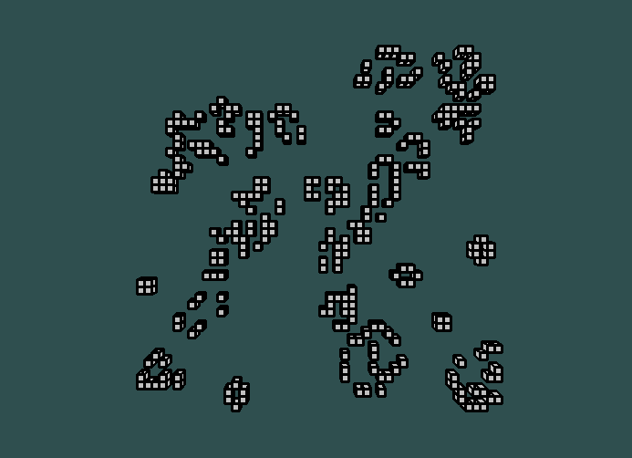
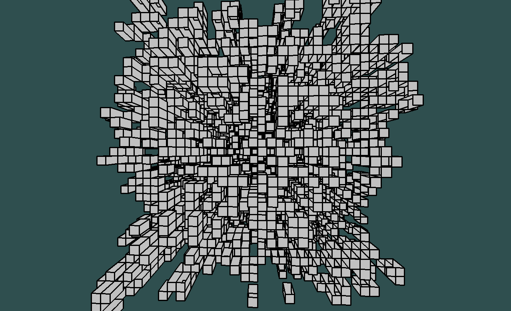

# Convay's GOL with pygame

The Game of Life is a cellular automaton devised by the British mathematician John Horton Conway in 1970 (https://en.wikipedia.org/wiki/Conway%27s_Game_of_Life).

There are plenty of implementations out there and all of them follow the same set of rules.
This implementation of the game uses `pygame` to give a visual presentation of the cells, it supports both 2D and 3D versions for the game.


## Run the simulation

Install required packages from the `Pipfile` 

```pipenv install Pipfile```

Check the parameter configuration

```
python simulation.py --help

usage: simulate.py [-h] [--win-size WIN_SIZE] [--simulation {2D,3D}]
                   [--dim DIM] [--population POPULATION] [--rules RULES]

optional arguments:
  -h, --help            show this help message and exit
  --win-size WIN_SIZE, -w WIN_SIZE
                        Window size (default: 1280x800)
  --simulation {2D,3D}, -s {2D,3D}
                        Simulation type (default: 2D)
  --dim DIM, -d DIM     Field dimensions (default: 10)
  --population POPULATION, -p POPULATION
                        Initial population in percent (default: 50)
  --rules RULES, -r RULES
                        Ruleset after which a cells' faith is decided; default
                        values are 2333 for 2D and 5766 for 3D (default: None)
```

Run the simulation with default parameters

```python simulation.py```


3D Simulation takes a bit of playing around with the settings since it will die off quite quickly. Here's an example setting:

```python simulate.py --simulation 3D --dim 35 --population 25```


 ## 2D version

 The 2D simulation uses the common rule set 2333 by default:

 - A live cell with fewer than 2 nieghbours dies in the next generation due to underpopulation
 - A live cell with 2-3 live neighbours lives in the next generation
 - A live cell with more than 3 live neighhours dies in the next generation due to overpopulation
 - A dead cell with exactly 3 live neighbours becomes a live cell in the next generation

 


## 3D version

 The 2D simulation uses the rule set 5766 by default:

 - A live cell with fewer than 5 nieghbours dies in the next generation due to underpopulation
 - A live cell with 5-7 live neighbours lives in the next generation
 - A live cell with more than 7 live neighhours dies in the next generation due to overpopulation
 - A dead cell with exactly 6 live neighbours becomes a live cell in the next generation


